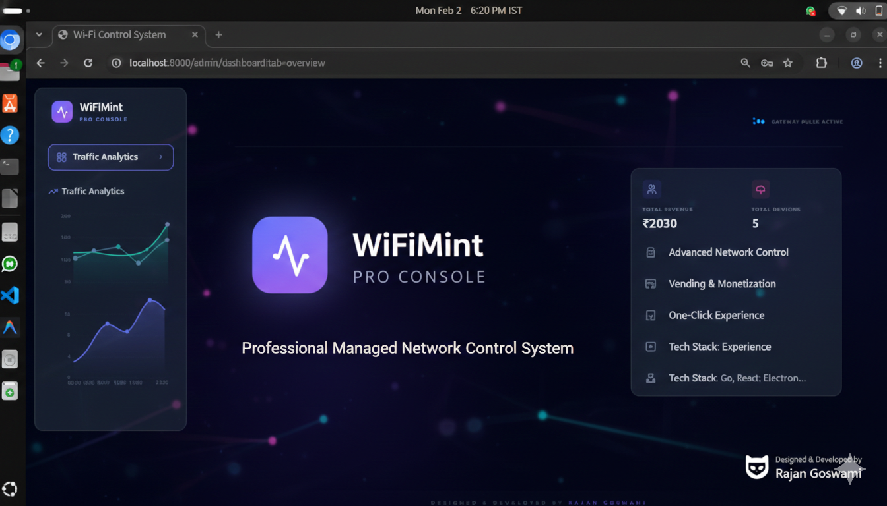
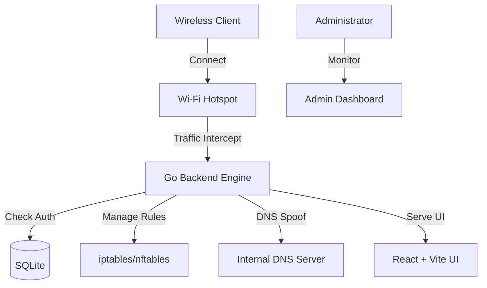

# WiFiMint - Ultra-Fast Managed Network Control System



**WiFiMint** is a premium, state-of-the-art Wi-Fi vending platform designed for ISPs, hotels, and public hotspots. It provides a seamless captive portal experience, automated network management, and a high-fidelity admin dashboard with a **Cyber-Premium Glassmorphism UI**.

---

## ✨ Key Features

- **� Instant Captive Portal**: Hyper-fast redirection for unauthorized users via DNS Hijacking.
- **🛡️ Secure Isolation**: Automated `iptables` rules and ARP spoofing to isolate untrusted clients.
- **💎 Cyber-Premium Design**: Stunning Glassmorphism interface for both Admin and User portals.
- **📊 Real-time Analytics**: Live monitoring of connected devices, revenue, and network health.
- **� Flexible Monetization**: Easily create and manage minutes-based internet plans.
- **🔌 Zero-Config**: Automated network interface detection and gateway setup.

---

## 🏗️ System Architecture



---

## � Linux Installation (Full Features)

Recommended for production use (Ubuntu/Debian).

### ⚡ One-Click Start
Run the following command to automatically install dependencies, build the UI, and start services:
```bash
sudo bash start.sh
```

### 🛠️ Manual Setup
1. **Clone the Project**:
   ```bash
   git clone https://github.com/rajan9182/WiFiMint.git
   cd WiFiMint
   ```
2. **Install Core Dependencies**:
   - [Go (1.22+)](https://go.dev/doc/install)
   - [Node.js (20+)](https://nodejs.org/)
   - Networking tools: `sudo apt install dsniff arpspoof conntrack net-tools`
3. **Build & Run**:
   - Frontend: `cd frontend && npm install && npm run build`
   - Backend: `cd backend && go run main.go`

---

## 🪟 Windows Setup & Compatibility

> [!WARNING]
> **Important**: Low-level networking (Captive Portal, Iptables) is Linux-specific and will **NOT** work natively on Windows.

### 🏠 Option 1: Full System (WSL2)
Use **Windows Subsystem for Linux** to run WiFiMint with full features.
1. **Setup WSL**: `wsl --install -d Ubuntu`
2. **Setup Bridge Networking**: Ensure your WSL instance can see the physical Wi-Fi interface.
3. **Follow Linux Steps**: Run `sudo bash start.sh` inside the WSL terminal.

### 🧪 Option 2: Development Mode (Native)
Run the UI and Logic on Windows for development or testing without network interception.
1. **Requirements**: Install [Go](https://go.dev/) and [Node.js](https://nodejs.org/).
2. **Terminal Setup**:
   ```powershell
   # Build Frontend
   cd frontend; npm install; npm run build
   # Run Backend
   cd backend; go run main.go
   ```
   *The server will run on `localhost:8080`, but Firewall/DNS commands will be skipped.*

---

## � Dashboards & Access

| Dashboard | URL | Access |
| :--- | :--- | :--- |
| **Admin Portal** | `http://localhost:8080/admin` | Monitoring & Management |
| **User Portal** | `http://<router-ip>:8080/login` | Client Login & Plans |
| **API Docs** | `http://localhost:8080/api/v1` | Backend Endpoints |

---

## 🔧 Troubleshooting

- **Port 8080 Busy**: Try `sudo fuser -k 8080/tcp` to free up the port.
- **No Redirection**: Ensure `systemd-resolved` and `avahi-daemon` are stopped as they conflict with Port 53.
- **Sticky Portal**: Some devices cache ARP. Reconnect the device to refresh.

---

## 👨‍💻 Author

**Designed & Developed by [Rajan Goswami](https://github.com/rajan9182)**
*Modern Managed Wi-Fi Control Solutions.*

---

## ⚖️ License
This project is licensed under the MIT License - see the [LICENSE](LICENSE) file for details.